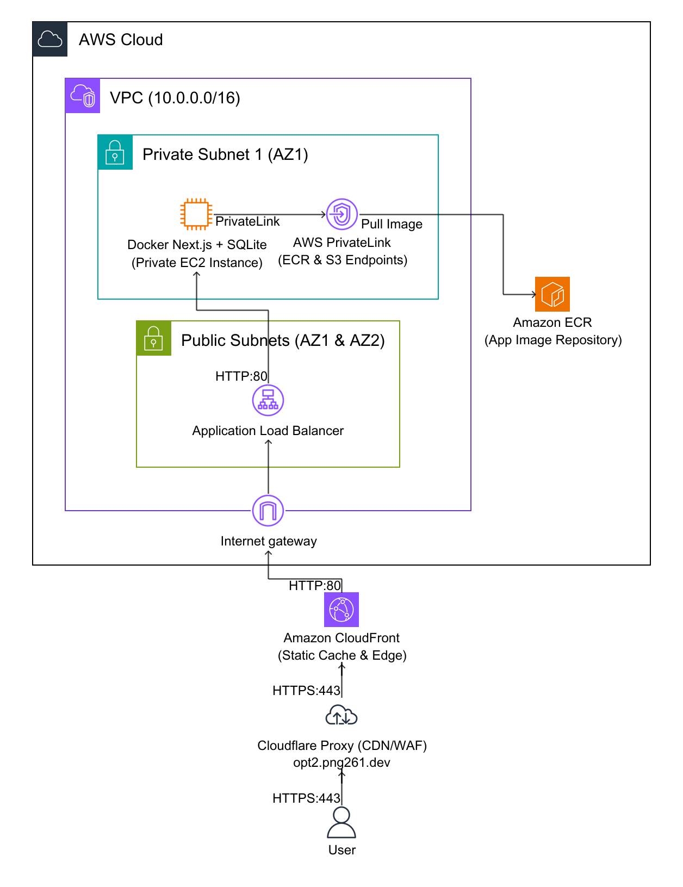
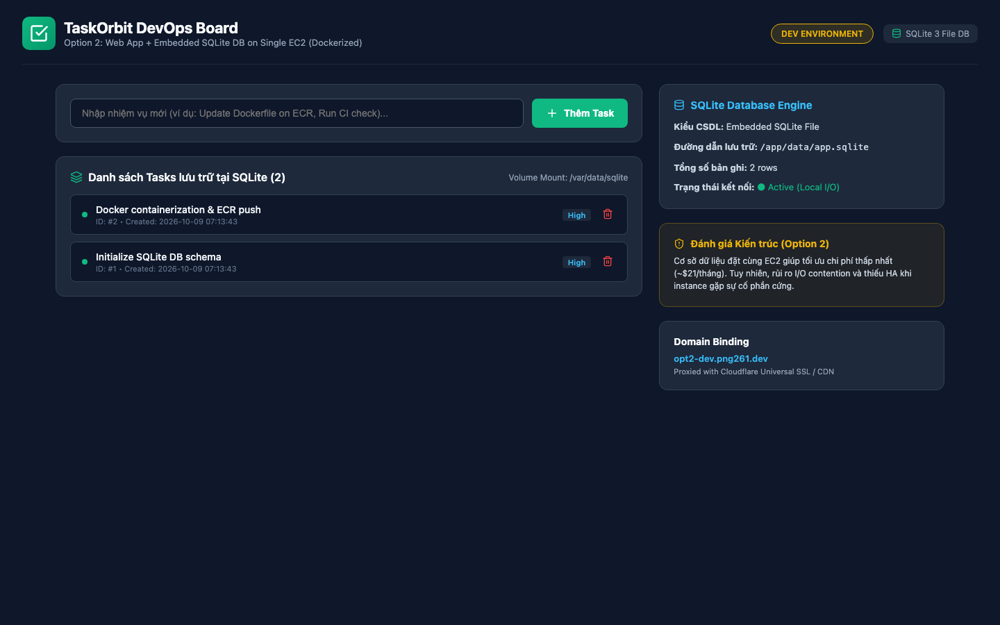
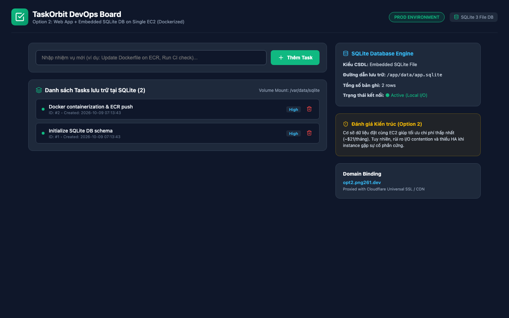

# Option 2: Web Application + Local MySQL DB on Single EC2

Hạ tầng và Mã nguồn ứng dụng độc lập cho **Option 2: Web Application + Local MySQL DB on Single EC2**.

## 1. Cấu trúc thư mục (File Structure)
```text
.
├── .github/workflows/ci-cd.yml   # CI/CD Pipeline (test code, lint CloudFormation, auto-deploy)
├── app/                          # Mã nguồn Website độc lập (Node.js/Express)
├── infra/                        # Mã nguồn CloudFormation hạ tầng AWS
│   ├── cloudformation.yaml       # Template CloudFormation độc lập
│   └── architecture_diagram.png  # Sơ đồ kiến trúc Diagram-as-Code
├── test/                         # Kiểm thử tự động (Unit test API & app)
│   └── test_api.js
└── README.md                     # Báo cáo kỹ thuật và ma trận chi phí
```

## 2. Báo cáo Chi phí Đa Chiều (Multi-Dimension Cost Analysis)

### A. Chi phí theo Mô hình Thanh toán (Khuyên dùng tối thiểu t3.medium 4GB RAM)
| Mô hình thanh toán | Đơn giá EC2 Compute | Thành phần phụ (IP + 50GB EBS + Backup) | Tổng chi phí / tháng | Quy đổi VNĐ |
| :--- | :--- | :--- | :--- | :--- |
| **On-Demand (Mặc định)** | $30.37 / tháng | $9.15 / tháng | **$39.52 / tháng** | ~998.000 VNĐ |
| **1-Year Savings Plan (Cam kết 1 năm)** | $19.13 / tháng | $9.15 / tháng | **$28.28 / tháng** *(Giảm 28%)* | ~714.000 VNĐ |
| **3-Year Savings Plan (Cam kết 3 năm)** | $12.13 / tháng | $9.15 / tháng | **$21.28 / tháng** *(Giảm 46%)* | ~537.000 VNĐ |
| **Spot Instance (Dev/Test)** | $9.07 / tháng | $9.15 / tháng | **$18.22 / tháng** *(Không khuyên dùng cho DB)* | ~460.000 VNĐ |

<!-- INFRACOST_START -->
### 💵 Kết quả Kiểm tra Chi phí Tự động CloudFormation (Infracost CI/CD Output)
*Thời gian kiểm tra: Sat Oct 10 05:43:29 UTC 2026*

```text
No costed resources detected.
```
<!-- INFRACOST_END -->

## 3. Kiến trúc Hạ tầng (Architecture Diagram)


### Điểm nổi bật của kiến trúc:
- **CloudFront CDN Edge Caching:** Caching tối ưu cho static assets (`/_next/static/*`, `/static/*`), giảm tải request vào EC2 instance duy nhất, giúp bảo vệ tài nguyên CPU/RAM cho database SQLite chạy cục bộ.
- **Single EC2 Web + Local Database:** Máy chủ EC2 chạy Dockerized Node.js/Next.js kết hợp database SQLite cục bộ lưu trên ổ đĩa EBS gp3 mã hóa.
- **Cloudflare Proxy + Custom Domain:** Định tuyến người dùng qua Cloudflare CDN/WAF tới CloudFront endpoint.

## 📸 Giao Diện Ứng Dụng Thực Tế (Live Screenshots - Dev & Prod)

| Môi trường Development (`opt2-dev.png261.dev`) | Môi trường Production (`opt2.png261.dev`) |
| :---: | :---: |
|  |  |

> 🚀 **Ghi chú triển khai:**
> - **Môi trường Dev (`opt2-dev.png261.dev`):** Chạy chế độ debug/development, kết nối cơ sở dữ liệu Dev, phục vụ kiểm thử tính năng mới.
> - **Môi trường Prod (`opt2.png261.dev`):** Chạy chế độ production tối ưu hóa hiệu năng cao, bảo mật nghiêm ngặt qua Cloudflare SSL/HTTPS.


## ⚛️ Ứng Dụng React & Quy Trình Đóng Gói Docker / Amazon ECR

### 1. Kiến trúc Ứng dụng Web
- **Tên ứng dụng:** **TaskOrbit DevOps Task Management Board**
- **Mô tả:** Bảng quản lý công việc và tiến độ triển khai DevOps tương tác cao bằng React 18, tích hợp CSDL SQLite 3 chạy cục bộ trên cùng máy chủ và ánh xạ qua Docker Volume Mount (/app/data).
- **Công nghệ Frontend:** React 18, Vite, Lucide Icons, Modern CSS Grid & Flexbox.
- **Backend & API:** Node.js Express phục vụ REST API và Single Page Application (SPA).
- **Cơ sở dữ liệu:** Embedded SQLite 3 (Lưu trữ trực tiếp trên EBS Volume gp3).

### 2. Tách biệt hoàn toàn Bước Build và Triển khai (Build once, Deploy everywhere)
Quy trình tuân thủ nghiêm ngặt chuẩn DevOps hiện đại:
1. **Multi-stage Docker Build:**
   - **Stage 1 (Builder):** Cài đặt `devDependencies`, biên dịch mã nguồn React và assets qua Vite (`npm run build`) tạo thư mục `dist/`.
   - **Stage 2 (Runner):** Chỉ sử dụng base image `node:20-alpine` tối giản, chỉ cài đặt production dependencies và nạp thư mục `dist/` cùng `server.js`. Image có kích thước siêu gọn (~150MB) và bảo mật cao.
2. **Đẩy Image lên Amazon ECR:**
   - Image sau khi build được tag theo môi trường (`latest` cho Prod, `dev-latest` cho Dev) và đẩy trực tiếp lên **Amazon Elastic Container Registry (ECR)**.
3. **Triển khai độc lập:**
   - Hạ tầng EC2 khi khởi tạo qua CloudFormation sẽ không tự build lại mã nguồn trên máy chủ.
   - Thay vào đó, máy chủ EC2 chỉ việc xác thực với ECR, kéo Docker image đã được kiểm thử về và chạy bằng `systemd` / `docker run`.

## 4. Quy trình CI/CD & Branching Strategy
- **dev**: Nhánh phát triển chính. Tự động chạy kiểm thử khi push/PR.
- **main**: Nhánh Production được bảo vệ (**Branch Protection Rule**). Chỉ cho phép merge từ nhánh **dev**.


## 🌐 Cấu Hình Tên Miền Tùy Chỉnh (Custom Domain: `png261.dev`)

Hạ tầng hỗ trợ ánh xạ tên miền `png261.dev` cho cả môi trường Development và Production:

| Môi trường | Nhánh Git | Subdomain | Loại bản ghi DNS | Giá trị đích (Target) | Proxy Cloudflare |
| :--- | :--- | :--- | :---: | :--- | :--- |
| **Development** | `dev` | `opt2-dev.png261.dev` | `CNAME` | `${CloudFrontDistribution.DomainName}` | Bật (Proxied ☁️) |
| **Production** | `main` | `opt2.png261.dev` | `CNAME` | `${CloudFrontDistribution.DomainName}` | Bật (Proxied ☁️) |

> 💡 **Khuyến nghị SSL/HTTPS qua Cloudflare:**
> Do tên miền `png261.dev` được quản trị Nameserver tại Cloudflare, khi tạo bản ghi `CNAME` với trạng thái **Proxied (Đám mây màu cam ☁️)**:
> - Cloudflare sẽ tự động cấp chứng chỉ **Universal SSL/TLS miễn phí** (HTTPS xanh).
> - Tự động kích hoạt CDN caching và bảo vệ chống tấn công DDoS Lớp 7.

## ☁️ Quản Lý Hạ Tầng Native CloudFormation (No State File)
Hạ tầng sử dụng 100% **AWS CloudFormation Native**:
- **State Managed by AWS:** Toàn bộ trạng thái tài nguyên do AWS quản lý tự động trực tiếp trên CloudFormation Engine.
- **Không cần lưu trữ State File:** Loại bỏ hoàn toàn rủi ro lộ bí mật, mất đồng bộ hoặc conflict state file (không cần S3/DynamoDB).
- **Drift Detection:** Cho phép kiểm tra độ lệch cấu hình trực tiếp từ AWS Console / AWS CLI mà không lo hỏng state.
