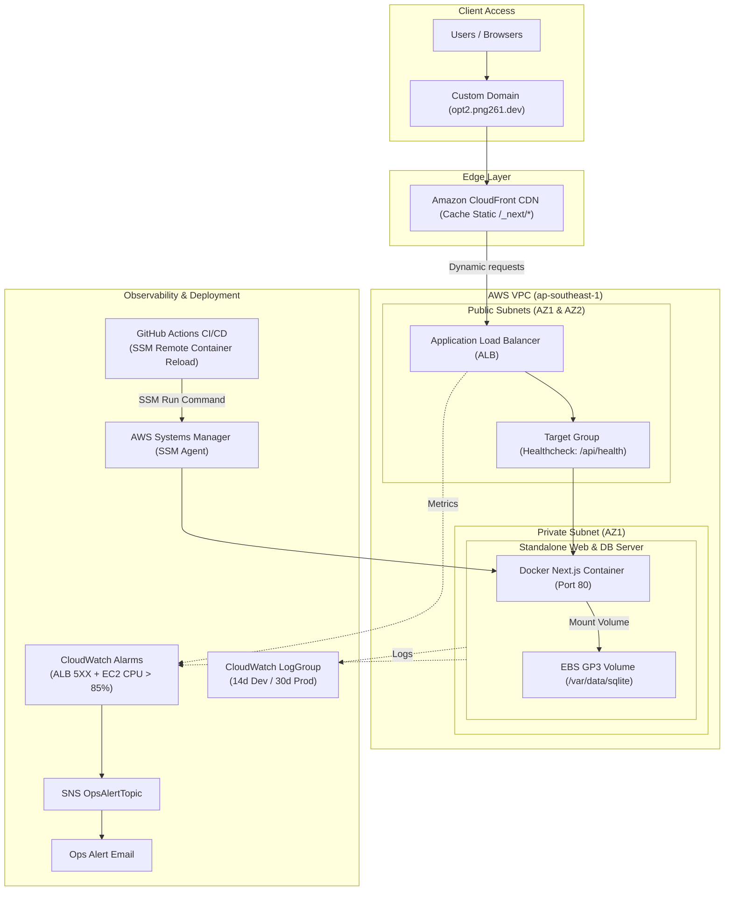

# Option 2: Web Application + Local DB on Single EC2

Independent infrastructure and application source code for **Option 2: Web Application + Local Persistent DB on Single EC2 with Amazon CloudFront Edge Caching**.

## 1. Directory Structure (File Structure)
```text
.
├── .github/workflows/ci-cd.yml   # CI/CD Pipeline (test code, lint CloudFormation, auto-deploy)
├── app/                          # Standalone web application (Next.js / Node.js)
├── docs/                         # Technical documentation (Deployment, Operations, Architecture)
├── infra/                        # AWS CloudFormation Infrastructure-as-Code
│   ├── cloudformation.yaml       # Consolidated CloudFormation template
│   ├── modules/                  # Modular templates (app.yaml, vpc-subnets.yaml, etc.)
│   ├── environments/             # Environment parameters for dev & prod
│   └── architecture_diagram.png  # Diagram-as-Code architecture diagram
├── test/                         # Automated tests (Unit test & API integration tests)
│   └── test_api.js
└── README.md                     # Technical report, cost matrix, and architectural summary
```

## 2. Multi-Dimension Cost Analysis

### A. Cost by Purchasing Option (t3.medium 4GB RAM Recommended for Web + DB)
| Purchasing Model | EC2 Compute | Supporting Components (IP + 50GB EBS + Backup) | Total Monthly Cost | Approx. Local Currency (VND) |
| :--- | :--- | :--- | :--- | :--- |
| **On-Demand (Default)** | $30.37 / mo | $9.15 / mo | **$39.52 / mo** | ~998,000 VND |
| **1-Year Savings Plan (1-Yr Commitment)** | $19.13 / mo | $9.15 / mo | **$28.28 / mo** *(28% savings)* | ~714,000 VND |
| **3-Year Savings Plan (3-Yr Commitment)** | $12.13 / mo | $9.15 / mo | **$21.28 / mo** *(46% savings)* | ~537,000 VND |
| **Spot Instance (Dev/Test Only)** | $9.07 / mo | $9.15 / mo | **$18.22 / mo** *(Not recommended for stateful DB)* | ~460,000 VND |

<!-- INFRACOST_START -->
### 💵 Automated CloudFormation Cost Scan (Infracost CI/CD Output)
*Scan timestamp: Sat Oct 10 09:30:46 UTC 2026*

```text
No costed resources detected.
```
<!-- INFRACOST_END -->

## 3. Architecture Overview




### Key Architectural Highlights:
- **CloudFront CDN Edge Caching:** Caches static assets (`/_next/static/*`) globally, reducing direct request pressure on the single EC2 server to preserve CPU/RAM for the co-located local database.
- **Application Load Balancer (ALB):** Spans Multi-AZ Public Subnets, handling SSL/TLS termination and forwarding traffic to the private EC2 instance.
- **Single EC2 Web + Local Database:** Runs the Dockerized Next.js application alongside a local SQLite database mounted onto an encrypted EBS gp3 volume (`/var/data/sqlite`).
- **AWS SSM Container Reload:** CI/CD triggers zero-SSH remote container updates via `aws ssm send-command`, pulling the latest image without opening inbound port 22.
- **Automated Monitoring & Alerts:** CloudWatch Alarms (ALB 5XX and EC2 CPU > 85%) notify engineers via Amazon SNS Topic; log retention auto-expires after 14 days (Dev) / 30 days (Prod).
- **AWS-Native Custom Domain:** Directs user traffic via DNS CNAME (DNS-only) directly to Amazon CloudFront Edge & ALB endpoints.

## 📸 Application Screenshots (Live Environments: Dev & Prod)

| Development Environment (`opt2-dev.png261.dev`) | Production Environment (`opt2.png261.dev`) |
| :---: | :---: |
|  |  |

> 🚀 **Deployment Notes:**
> - **Development (`opt2-dev.png261.dev`):** Runs debug mode with dev configuration parameters.
> - **Production (`opt2.png261.dev`):** Optimized production mode with automated EBS volume persistence and AWS ACM SSL encryption.

## ⚛️ Web Application & Docker / Amazon ECR Delivery

### 1. Web Application Architecture
- **Application:** Next.js Dashboard & Management Platform.
- **Frontend Stack:** React 18, Next.js App Router, Tailwind CSS, Lucide Icons.
- **Backend & API:** Node.js Next.js Server Actions and REST API routes.
- **Database:** Local embedded persistent database (stored directly on encrypted EBS gp3 volume).

### 2. Separation of Build and Deployment (Build Once, Deploy Everywhere)
1. **Multi-Stage Docker Build:**
   - **Stage 1 (Builder):** Compiles Next.js frontend assets and server components.
   - **Stage 2 (Runner):** Lightweight `node:20-alpine` base image containing only required production runtime files.
2. **Push to Amazon ECR:**
   - Image tagged by environment (`latest` for Prod, `dev-latest` for Dev) and pushed to **Amazon Elastic Container Registry (ECR)**.
3. **Decoupled Deployment:**
   - Host EC2 instance does not rebuild code on-box. It pulls tested containers from ECR and manages runtime lifecycle via `systemd`.

## 4. CI/CD Workflow & Branching Strategy
- **`dev`**: Main development branch. Automatically runs tests and builds development containers.
- **`main`**: Protected production branch (**Branch Protection Rules** enforce PR reviews). Merging triggers automated production deployment and SSM remote container reload.

## 🌐 Custom Domain Configuration (`png261.dev`)

The infrastructure routes traffic for `png261.dev` across both environments:

| Environment | Git Branch | Subdomain | Record Type | Target Destination | Proxy Status |
| :--- | :--- | :--- | :---: | :--- | :--- |
| **Development** | `dev` | `opt2-dev.png261.dev` | `CNAME` | `${CloudFrontDistribution.DomainName}` | DNS Only (☁️ Grey Cloud) |
| **Production** | `main` | `opt2.png261.dev` | `CNAME` | `${CloudFrontDistribution.DomainName}` | DNS Only (☁️ Grey Cloud) |

## ☁️ Native AWS CloudFormation Infrastructure Management (No State File)
The entire infrastructure is 100% managed with **AWS CloudFormation Native**:
- **AWS-Managed State:** Resource state is maintained internally by AWS CloudFormation.
- **Zero State File Overhead:** Eliminates state locking conflicts, accidental leaks, and S3/DynamoDB maintenance overhead.
- **Drift Detection:** Enables automated configuration drift detection directly from the AWS Console or AWS CLI.
